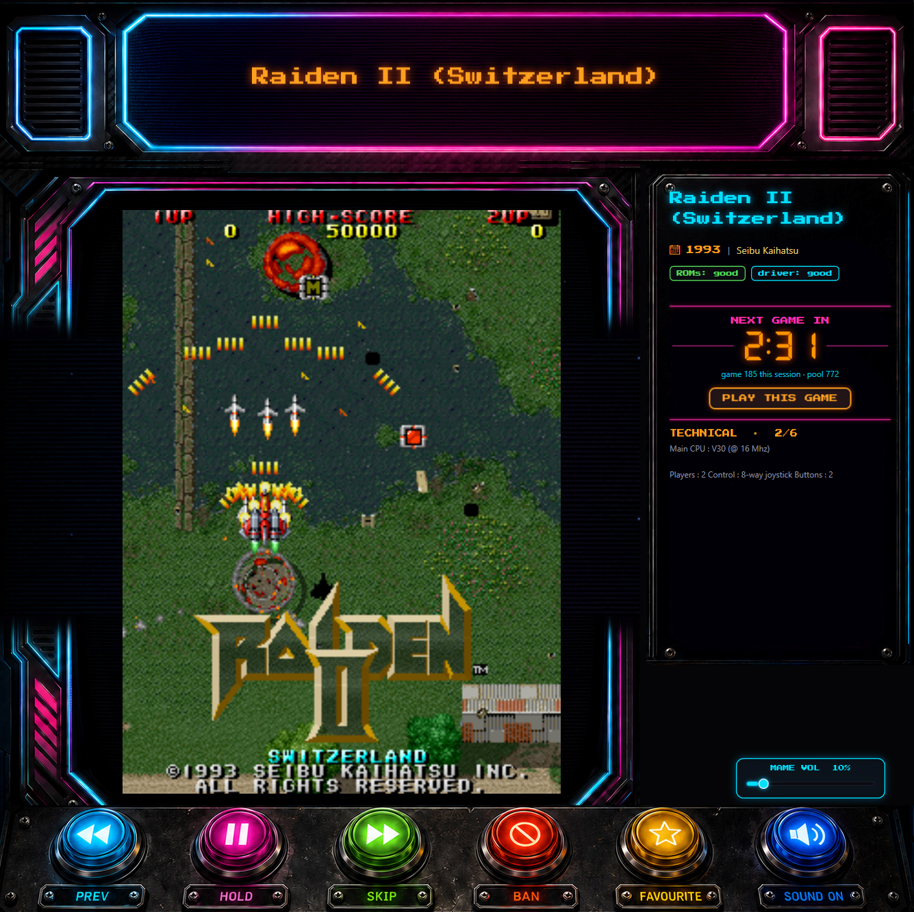
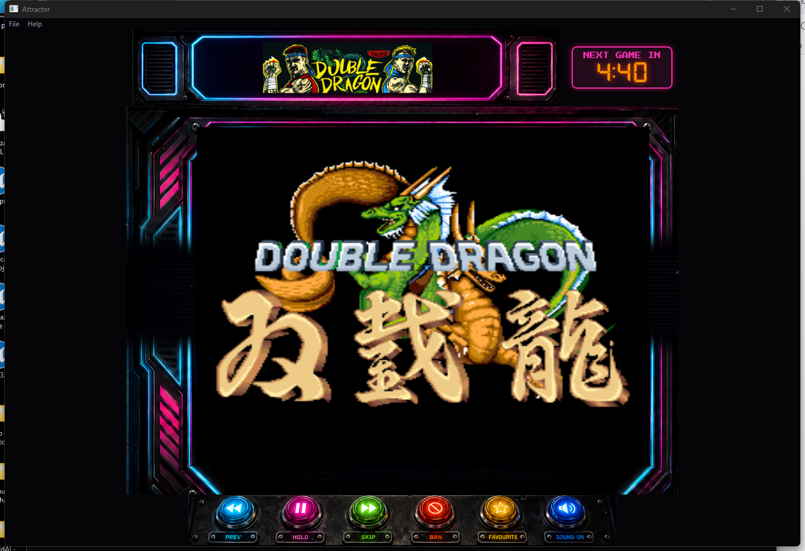

# Ghostcade

*Discover the games in your MAME collection with this compact MAME attract mode cab.*

**Do you have many ROMs? Have you only played a few of them? What gems have you never seen?**

Ghostcade works through your collection. It picks a game, launches it using your MAME emulator,
and lets the machine run its own *attract mode*. The demo runs for a few minutes, then moves on to the
next one. The actual game, actually running, showing you what it is.

**Discovery is the point.** A big ROM set isn't a library you work through,
it's a haystack — and the good stuff in there is mostly things you'd never
think to go looking for by name. Ghostcade puts it in front of you a few
minutes at a time, in the background, while you get on with something else.

And it looks the part while it does it: the live MAME window sits inside a
neon cabinet, the game's marquee glowing above it and its history, trivia and
scoring tips scrolling down the side, an '80s arcade idling in the corner of
your desk.



On shorter screens it switches to a slim layout that drops the side panel and
scales the chrome down:



---

## Features

- **Games Filters:** Decades, manufacturers and/or genres you care about. Show me fighting games from the 80s!
- **Shuffle with no repeats:** Until your whole collection has had a turn and it remembers where it's up to across restarts.
- **Cool cabinet art:** Embeds the real MAME window inside a neon arcade cabinet, with the game's marquee art up top.
- **Game Trivia:** A side panel showing the title, year, manufacturer and the game's story.
- **"I want a go!":** One press of 'Play this game' hands you the current game for real: a fresh, focused MAME session. Quit MAME and the rotation carries on where it left off.


## Requirements

- Windows 10 / 11 (x64)
- **Your own MAME** (anything from v0.147 to current) and **your own ROMs**,
  set up and working in MAME already.
- The .NET 10 Desktop Runtime — the installer offers to fetch it if it's
  missing, or grab the self-contained build which needs nothing extra.

## Install

**Installer** (recommended): download `Ghostcade-x.y.z-Setup.exe` from the
[latest release](https://github.com/Stargx/ghostcade/releases), run it (it's a
per-user install, no admin needed), and it'll set up the runtime if required.

**Portable**: download `Ghostcade-x.y.z-portable.zip`, unzip anywhere writable,
run `Ghostcade.exe`. Self-contained — no runtime install needed.

> Ghostcade 0.2.0 is an early public release. Builds aren't code-signed yet, so
> Windows SmartScreen will warn "unknown publisher" the first time ("More info →
> Run anyway"). The signing pipeline is already in place — it just needs a
> certificate.

## Optional

- **Genre File**. The genre list appears when a `catver.ini` sits next to `mame.exe`. It's the fan-maintained category file from
  [progettosnaps.net](https://www.progettosnaps.net/catver/); Download and copy to you MAME.exe folder.

## First run

A short wizard walks you through it:

1. **Point it at your `mame.exe`** (any version 0.147+). It does a quick check
   that it's really MAME.
2. **Confirm your artwork folders** — it auto-finds `marquees\` and `snap\`
   next to MAME. Skip if you don't have them (you'll get title text instead).
3. **Scan** — a one-time pass that reads MAME's machine list and verifies which
   ROM sets you actually have. Over a network share this can take a few
   minutes; it's cached, so every later start is instant.

That's it — rotation starts automatically.

## Controls

On-screen buttons, plus global hotkeys that work even when another app has
focus:

| Button | Hotkey | Action |
|---|---|---|
| Prev | `Ctrl+Alt+Left` | Go back to the previous game |
| Hold | `Ctrl+Alt+Down` | Pause rotation — current game keeps demoing |
| Skip | `Ctrl+Alt+Right` | Jump to the next game |
| Ban | `Ctrl+Alt+B` | Never show this game again |
| Favourite | `Ctrl+Alt+F` | Star the current game (then rotate just your stars via **File → Filter → Favourites only**) |
| Play this game | `Ctrl+Alt+P` | Take the controls: a real, focused MAME session with no time cap — quit MAME to resume the rotation |
| Sound On/Off | `Ctrl+Alt+M` | Mute just MAME (not the rest of your system) |
| Volume −/+ | `Ctrl+Alt+-` / `Ctrl+Alt+=` | Lower / raise MAME's own volume in 10% steps (per-app, not your Windows volume) |

Hotkeys are remappable in `config.json`.

The full layout also has a **volume slider** above the buttons (MAME's own level,
independent of Windows). The menu bar adds:

- **File → Play this game** — the same "take the controls" action as the panel
  button and `Ctrl+Alt+P`.
- **File → Filter** — restrict the rotation by **decade**, **manufacturer** and/or
  **genre**, or to **Favourites only** (the choices combine, and stick across
  restarts). The genre list appears when a `catver.ini` sits next to `mame.exe`
  (or in its `folders\` subfolder, or wherever `mame.catverPath` in
  `config.json` points) — it's the fan-maintained category file from
  [progettosnaps.net](https://www.progettosnaps.net/catver/); Ghostcade doesn't
  ship it. While a genre is ticked, games catver.ini doesn't list sit the
  rotation out.
- **File → Time out** — how long each game demos before moving on (1–15 min), live.
- **Help → About** — version and credits.

Ghostcade also plays its own cabinet sound effects — a startup jingle, a coin when
it changes game, a click on the buttons — separate from the Sound On/Off button
(which only silences MAME). Turn them off or change their volume in the `sound`
section of `config.json`.

## Configuration

Everything lives in a portable `data\` folder **next to the app** (no hunting
through `%AppData%`). Use **File → Open config folder** to find it. Settings are
in `config.json`; see [docs/config.md](docs/config.md) for the full reference.
Two hand-editable lists live there too:

- `banned.txt` — one short name per line; remove a line to un-ban.
- `favorites.txt` — your starred games; turn on **File → Filter → Favourites only**
  to rotate just these.

`File → Rescan ROMs` rebuilds the catalog after you add games. The `filter`, `sound`
and `mame.volume` settings are also adjustable live from the menus and the volume
slider — changes there are saved back to `config.json`.

## FAQ

**Why does the game briefly restart every few minutes?**
MAME only suppresses its "this game has problems" warning screens when a session
runs under 300 seconds, so Ghostcade runs each game in chunks under that. With the
default ~5-minute dwell (change it to 1–15 min under **File → Time out**), a longer
dwell relaunches the same game between chunks — a brief blink. It's the price of a
clean, warning-free picture.

**Why did a game I have never appear / get skipped?**
A full no-repeat cycle of a big collection takes many hours of running, so over
a single session you'll only see a slice — but it remembers its place, so given
time it works through everything. Games whose driver MAME flags as
non-working, plus BIOS/device sets, are filtered out. If you've set a
**File → Filter** (decade / manufacturer / genre / favourites), anything outside
it is skipped too.

**It opened tiny / on the wrong layout.**
It remembers its last window size. Resize it once and it sticks. Below 1080px
tall it uses the slim layout on purpose.

**Can I actually play what's on screen?**
Yes — that's the one exception to "watch, don't play". Hit **Play this game**
(`Ctrl+Alt+P`) and Ghostcade swaps the attract demo for a real, focused MAME
session: insert coins, play as long as you like (no 5-minute chunking — you're
there to dismiss any warnings yourself). Quit MAME (Esc by default) and the
rotation resumes automatically.

**Does it capture my keyboard / mouse?**
No. The emulator is launched without grabbing focus or the mouse, so you can
keep working with it running. (The deliberate exception: **Play this game**
launches focused, because you asked to play.)

## Build from source

```
git clone https://github.com/Stargx/ghostcade
cd ghostcade
dotnet build Attractor.slnx -c Release
dotnet test Attractor.slnx -c Release
```

Solution layout: `Attractor.Core` (engine + MAME interaction, no UI),
`Attractor.App` (WPF), `Attractor.Core.Tests` (xunit), `Attractor.Smoke`
(headless harness). *Ghostcade was called Attractor before its first public
release; the namespaces and project names kept the old name as an internal
codename rather than churn every file for a rename nobody sees.* The original
PowerShell prototype is preserved under `prototype/`.

## Credits & licence

Ghostcade is written by **Steve Hunt** <steve@coldbeamgames.com>
([Cold Beam Games](https://coldbeamgames.com)) and is MIT licensed (see
[LICENSE](LICENSE)). Bundled fonts —
[Press Start 2P](https://github.com/google/fonts/tree/main/ofl/pressstart2p)
and [DSEG](https://github.com/keshikan/DSEG) — are under the SIL Open Font
License (see `src/Attractor.App/assets/fonts`). The bundled UI sound effects
(`src/Attractor.App/assets/audio`) are original / royalty-free and free to
redistribute.

MAME® is a registered trademark of Gregory Ember. Ghostcade is an independent
companion utility that drives your own copy of MAME — it is not affiliated with,
endorsed by, or derived from the MAME project, and includes no MAME code, ROMs, or
game artwork.
